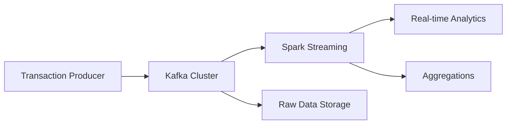

# E2E Data Engineering Project: High-Performance Financial Transaction Processing

🚧 Project Status: Under Active Development 🚧

[](https://openjdk.org/projects/jdk/17/)
[](https://kafka.apache.org/)
[](https://spark.apache.org/)
[](https://www.docker.com/)

A production-grade data engineering pipeline designed to handle massive-scale financial transaction processing with high
throughput, fault tolerance, and real-time analytics capabilities.

## 🚀 System Capabilities

- **Processing Volume**: 1.2 billion transactions per hour
- **Storage Capacity**: Handles up to 1.852 PB of data (5-year projection with 20% YoY growth)
- **Compression Ratio**: 5:1 using Snappy compression
- **High Availability**: Triple replication for fault tolerance
- **Real-time Processing**: Sub-second latency for transaction analytics
- **Scalable Architecture**: Horizontally scalable Kafka-Spark infrastructure

## 📊 Data Specifications

### Transaction Schema

```scala
case class Transaction (
    transactionId: String,      // 36 bytes
    amount: Float,              // 8 bytes
    userId: String,             // 12 bytes
    transactionTime: BigInt,    // 8 bytes
    merchantId: String,         // 12 bytes
    transactionType: String,    // 8 bytes
    location: String,           // 12 bytes
    paymentMethod: String,      // 15 bytes
    isInternational: Boolean,   // 5 bytes
    currency: String            // 5 bytes
)                              // Total: 120 bytes
```

### Storage Requirements

| Time Period | Raw Data  | With 3x Replication & Compression |
|-------------|-----------|-----------------------------------|
| Per Hour    | 144 GB    | 86.4 GB                           |
| Per Day     | 3.456 TB  | 2.07 TB                           |
| Per Month   | 103.68 TB | 62.1 TB                           |
| Per Year    | 1.244 PB  | 745.2 TB                          |

## 🛠 Technology Stack

- **Apache Kafka 3.8.1**: Distributed streaming platform
    - 3 Controller nodes for cluster management
    - 3 Broker nodes for data distribution
    - Schema Registry for data governance
- **Apache Spark 3.5.0**: Real-time data processing
    - 1 Master node
    - 3 Worker nodes
    - Structured Streaming for real-time analytics
- **Additional Components**:
    - RedPanda Console for cluster monitoring
    - Docker & Docker Compose for containerization
    - Java 17 for transaction generation
    - Python for Spark processing

## 🚀 Getting Started

### Prerequisites

- Docker and Docker Compose
- Java 17 or later
- Maven
- Python 3.8 or later

### Quick Start

1. Clone the repository:

```bash
git clone https://github.com/yourusername/kafka-spark-data-engineering.git
cd kafka-spark-data-engineering
```

2. Start the infrastructure:

```bash
docker-compose up -d
```

3. Build and run the transaction producer:

```bash
mvn clean package
java -jar target/transaction-producer.jar
```

4. Start the Spark processor:

```bash
python spark_processor.py
```

### Accessing Services

- RedPanda Console: http://localhost:8080
- Spark Master UI: http://localhost:9190
- Schema Registry: http://localhost:18081

## 🏗 Architecture



## 🔧 Configuration

### Kafka Configuration

- Bootstrap Servers: `localhost:29092,localhost:39092,localhost:49092`
- Topics:
    - `financial_transactions`: Raw transaction data
    - `transaction_aggregates`: Processed aggregations
    - `transaction_anomalies`: Detected anomalies

### Spark Configuration

- Master URL: `spark://spark-master:7077`
- Worker Resources:
    - Cores: 2 per worker
    - Memory: 2GB per worker
- Checkpoint Directory: `/mnt/spark-checkpoints`
- State Store: `/mnt/spark-state`

## 📈 Performance Optimization

### Producer Optimizations

- Batch Size: 64KB
- Linger Time: 3ms
- Compression: Snappy
- Acknowledgments: 1 (leader acknowledgment)
- Multi-threaded production: 3 concurrent threads

### Consumer Optimizations

- Structured Streaming for efficient processing
- Checkpointing for fault tolerance
- State store for stateful operations
- Partition optimization for parallel processing

## 🔍 Monitoring

- Transaction throughput logging
- Kafka cluster health monitoring via RedPanda Console
- Spark UI for job tracking and performance metrics
- Producer performance metrics with throughput calculation

## 📄 License

This project is licensed under the MIT License - see the [LICENSE](LICENSE) file for details.

## 🤝 Contributing

Contributions are welcome! Please read our [Contributing Guide](CONTRIBUTING.md) for details on our code of conduct and
the process for submitting pull requests.
